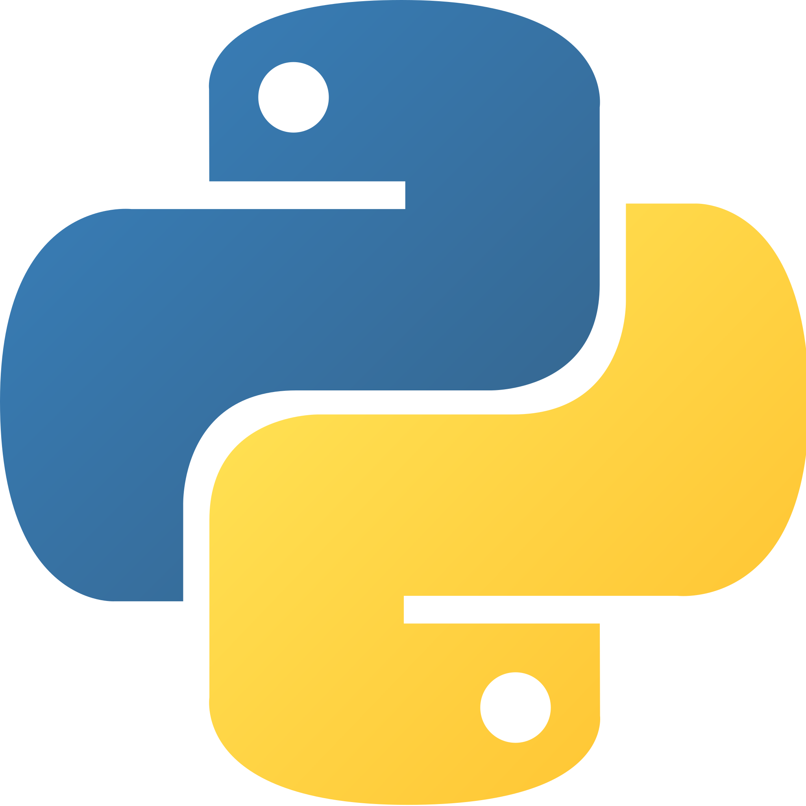

<!-- PROJECT SHIELDS -->
<!--
*** I'm using markdown "reference style" links for readability.
*** Reference links are enclosed in brackets [ ] instead of parentheses ( ).
*** See the bottom of this document for the declaration of the reference variables
*** for contributors-url, forks-url, etc. This is an optional, concise syntax you may use.
*** https://www.markdownguide.org/basic-syntax/#reference-style-links
-->
<div align="left">

[![Contributors][contributors-shield]][contributors-url]
[![Forks][forks-shield]][forks-url]
[![Stargazers][stars-shield]][stars-url]

</div>

<a href="https://github.com/Kaweees/modern-python">
  
</a>

<div align="left">
  <h1><em><a href="https://miguelvf.dev/blog/dotfiles/compendium">~modern-python</a></em></h1>
</div>

<!-- ABOUT THE PROJECT -->

A template for developing production-ready Python applications.

### Built With

[![Python][Python-shield]][Python-url]
[![GitHub Actions][github-actions-shield]][github-actions-url]
[![Docker][Docker-shield]][Docker-url]

<!-- GETTING STARTED -->

## Getting Started

### Prerequisites

Before attempting to build this project, make sure you have [Python 3.10 or higher](https://www.python.org/downloads/), [just](https://just.systems/), and [uv](https://docs.astral.sh/uv/#getting-started) installed on your machine.

### Installation

To get a local copy of the project up and running on your machine, follow these simple steps:

1. Clone the project repository

   ```sh
   git clone https://github.com/Kaweees/modern-python.git
   cd modern-python
   ```

2. Install the environment

   ```sh
   just setup
   ```

3. Run the pre-commit hooks

   ```sh
   just pre_commit
   ```

4. Run the project

   ```sh
   just run
   ```

<!-- PROJECT FILE STRUCTURE -->

## Project Structure

```sh
graphics/
├── .github/                       - GitHub Actions CI/CD workflows
├── include/                       - project header files
├── src/                           - project source files
│   └── main.c                     - Entry point, main function
├── CMakeLists.txt                 - CMake build script
├── LICENSE                        - project license
└── README.md                      - you are here
```

## License

The source code for this project is distributed under the terms of the MIT License, as I firmly believe that collaborating on free and open-source software fosters innovations that mutually and equitably beneficial to both collaborators and users alike. See [`LICENSE`](./LICENSE) for details and more information.

<!-- MARKDOWN LINKS & IMAGES -->
<!-- https://www.markdownguide.org/basic-syntax/#reference-style-links -->

[contributors-shield]: https://img.shields.io/github/contributors/Kaweees/modern-python.svg?style=for-the-badge
[contributors-url]: https://github.com/Kaweees/modern-python/graphs/contributors
[forks-shield]: https://img.shields.io/github/forks/Kaweees/modern-python.svg?style=for-the-badge
[forks-url]: https://github.com/Kaweees/modern-python/network/members
[stars-shield]: https://img.shields.io/github/stars/Kaweees/modern-python.svg?style=for-the-badge
[stars-url]: https://github.com/Kaweees/modern-python/stargazers

<!-- MARKDOWN SHIELD BAGDES & LINKS -->
<!-- https://github.com/Ileriayo/markdown-badges -->

[Python-shield]: https://img.shields.io/badge/Python-%23008080.svg?style=for-the-badge&logo=python&logoColor=306998&labelColor=222222&color=306998
[Python-url]: https://www.python.org/
[github-actions-shield]: https://img.shields.io/badge/github%20actions-%232671E5.svg?style=for-the-badge&logo=githubactions&logoColor=2671E5&labelColor=222222&color=2671E5
[github-actions-url]: https://github.com/features/actions
[Docker-shield]: https://img.shields.io/badge/docker-%232671E5.svg?style=for-the-badge&logo=docker&logoColor=1D63ED&labelColor=222222&color=1D63ED
[Docker-url]: https://www.docker.com/
